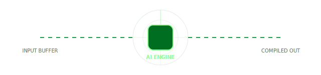
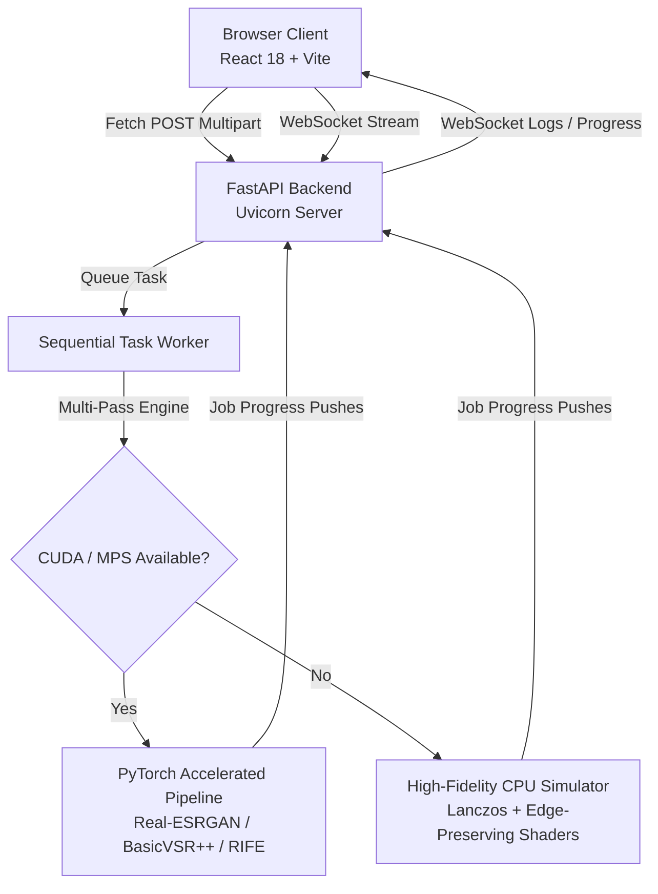

<!-- Header Block -->
<div align="center">
  <br />
  
  
  <p>
    <!-- AI Pipeline Pulse Monitor (Glow CSS vector SVG) -->
  </p>
</div>

<hr style="border: 0; height: 1px; background-image: linear-gradient(to right, rgba(0, 110, 32, 0), rgba(0, 110, 32, 0.4), rgba(0, 110, 32, 0));" />

<div align="center">
  <h3>⚡ Live AI Processing Pipeline Monitor</h3>
  <br />
  
</div>

<br />

---

## 🌟 Key Features

<table width="100%">
  <tr>
    <td width="50%" valign="top">
      <h3>🖼️ AI Image Super-Resolution</h3>
      <ul>
        <li><b>Multi-Scale Selector</b>: 2×, 4×, 8× progressive, or Custom multiplier bounds from 1.5× to 16×.</li>
        <li><b>Next-Gen SOTA Models</b>: Real-ESRGAN, SwinIR Attention Transformer, and Generative SUPIR Diffusion.</li>
        <li><b>Interactive Split Canvas</b>: Real-time mouse-tracking comparator displaying raw source alongside actual compiled outputs.</li>
      </ul>
    </td>
    <td width="50%" valign="top">
      <h3>🎬 Temporal Video Upscaler</h3>
      <ul>
        <li><b>Cinema Presets</b>: Upscale to 1080p Full HD, 4K Cinema, or 8K Super Hi-Vision.</li>
        <li><b>RIFE Interpolation</b>: Smart motion vector calculations to double or quadruple FPS (30 to 60/120 fps).</li>
        <li><b>Device-Tailored Estimation</b>: Live dynamic estimation mathematically calculating execution times.</li>
      </ul>
    </td>
  </tr>
</table>

---

## 🎨 Visual Design Token System

This project is built strictly around a customized **Material 3 Mint System** for premium glassmorphism:

<div align="center">
  <table style="border-collapse: collapse; border: none; background: transparent;">
    <tr style="background: transparent;">
      <td align="center" style="border: none;">
        <div style="width: 60px; height: 60px; background-color: #006e20; border-radius: 16px; box-shadow: 0 4px 12px rgba(0,110,32,0.3); border: 2px solid white;"></div>
        <code style="font-size: 11px;">#006e20</code><br /><b>Primary Mint</b>
      </td>
      <td align="center" style="border: none; padding-left: 20px;">
        <div style="width: 60px; height: 60px; background-color: #98ff98; border-radius: 16px; box-shadow: 0 4px 12px rgba(152,255,152,0.3); border: 2px solid white;"></div>
        <code style="font-size: 11px;">#98ff98</code><br /><b>Container Highlight</b>
      </td>
      <td align="center" style="border: none; padding-left: 20px;">
        <div style="width: 60px; height: 60px; background-image: radial-gradient(circle at top left, #f9f9f9, #eff7f1, #e8f3ea); border-radius: 16px; box-shadow: 0 4px 12px rgba(0,0,0,0.05); border: 2px solid #ccc;"></div>
        <code style="font-size: 11px;">Radial Gradient</code><br /><b>Background Depth</b>
      </td>
      <td align="center" style="border: none; padding-left: 20px;">
        <div style="width: 60px; height: 60px; background-color: rgba(255,255,255,0.45); backdrop-filter: blur(24px); border-radius: 16px; box-shadow: 0 4px 12px rgba(0,0,0,0.05); border: 1px solid rgba(255,255,255,0.6);"></div>
        <code style="font-size: 11px;">Glassmorphic</code><br /><b>Sidebar Panels</b>
      </td>
    </tr>
  </table>
</div>

---

## ⚡ Technical Architecture



---

## 🛠️ Interactive Details & Hardware Estimation

<details>
  <summary style="font-family: 'Sora', sans-serif; font-weight: 600; color: #006e20; cursor: pointer; padding: 8px 12px; background: rgba(0, 110, 32, 0.05); border-radius: 12px; outline: none; margin-bottom: 8px;">
    🧬 How the Device-Adaptive Time Estimator works (Click to Expand)
  </summary>
  <div style="padding: 12px; line-height: 1.6;">
    <p>UpscaleForge has an integrated performance profiling algorithm. When the workspace loads, the frontend queries the backend system resources to detect your GPU hardware tier:</p>
    <ul>
      <li><b>Accelerated Tier (NVIDIA CUDA / Apple Silicon MPS)</b>: Estimates use low base coefficients, enabling lightning-fast predictions (e.g., ~3s for standard 4x images).</li>
      <li><b>Fallback CPU Tier</b>: Automatically applies a 3.5× to 5.0× multiplier factor to match processing timelines on non-GPU instances.</li>
      <li><b>Dynamic Video Formula</b>:
        <pre>Total Frames = Video Duration × Selected Target FPS (30/60/120)<br />Total Time = Total Frames × Model Weight × Resolution Factor × Device Coefficient</pre>
      </li>
    </ul>
  </div>
</details>

### 🚀 Complete Setup & Installation Guide

This guide will help you set up UpscaleForge on your computer step-by-step. We have written it in simple, everyday language so that anyone—even if you have never run a program from the terminal before—can easily follow along!

---

#### 📦 1. Pre-requirements (What you need on your computer)

Think of these as the ingredients you need before cooking. You need three things:

##### A. Python (The Brains of the Operation)
* **What it does:** Runs our AI processing backend server.
* **How to get it:**
  * **Download:** Go to [python.org/downloads](https://www.python.org/downloads/) and download the latest version for your computer (Windows or Mac).
  * **⚠️ IMPORTANT (Windows Users):** When installing, **make sure to check the box that says "Add Python to PATH"** at the bottom of the installer window!
  * **Verify:** Open your Terminal (Mac) or Command Prompt (Windows) and type:
    ```bash
    python --version
    ```
    (If that doesn't work, try `python3 --version`). You should see a number like `Python 3.10.x` or higher.

##### B. Node.js (The User Interface Engine)
* **What it does:** Runs the beautiful web screen (frontend) where you upload images/videos.
* **How to get it:**
  * **Download:** Go to [nodejs.org](https://nodejs.org/) and download the **LTS (Long Term Support)** version. It has a green button. Just click next-next-finish to install it.
  * **Verify:** Open your terminal and type:
    ```bash
    node --version
    npm --version
    ```
    You should see two version numbers (like `v20.x.x` and `10.x.x`).

##### C. FFmpeg (The Video Wizard)
* **What it does:** Helps process and chop up videos for upscaling.
* **How to get it:**
  * 🍎 **Mac Users:** Open your terminal, paste this command, and press Enter:
    ```bash
    brew install ffmpeg
    ```
    *(If you don't have Homebrew installed, copy-paste this first: `/bin/bash -c "$(curl -fsSL https://raw.githubusercontent.com/Homebrew/install/HEAD/install.sh)"`)*
  * 💻 **Windows Users:** Open Command Prompt *as Administrator* (right-click and choose "Run as Administrator"), paste this command, and press Enter:
    ```cmd
    winget install Gyan.FFmpeg
    ```
    *(Alternatively, download it from [ffmpeg.org](https://ffmpeg.org/download.html), unzip it, and add the `bin` folder to your System Environment variables).*
  * 🐧 **Linux Users (Ubuntu/Debian):** Type:
    ```bash
    sudo apt update && sudo apt install ffmpeg -y
    ```
  * **Verify:** Type:
    ```bash
    ffmpeg -version
    ```
    You should see a bunch of text starting with `ffmpeg version...`. If you do, you are ready!

---

#### 💻 2. Step-by-Step Installation

Now, let's assemble the project!

##### Step A: Download the Code
If you know how to use Git, run this in your terminal:
```bash
git clone https://github.com/Anuj-9009/upscaleforge.git
cd upscaleforge
```
*If you don't know what Git is,* simply click the green **"Code"** button at the top of this GitHub page, click **"Download ZIP"**, extract the ZIP file somewhere on your computer, open your terminal, and navigate into that folder!

##### Step B: Set Up the Backend Server (Terminal 1)
Open a terminal window and type the following commands line by line:

1. **Navigate to the backend directory:**
   ```bash
   cd backend
   ```
2. **Create a Virtual Environment (A safe container so dependencies don't get mixed up):**
   ```bash
   python -m venv venv
   ```
   *(If you are on Linux or Mac, you might need to use `python3 -m venv venv`)*
3. **Activate the Virtual Environment:**
   * 🍎 **Mac / Linux:**
     ```bash
     source venv/bin/activate
     ```
   * 💻 **Windows (Command Prompt):**
     ```cmd
     venv\Scripts\activate
     ```
   * 💻 **Windows (PowerShell):**
     ```powershell
     .\venv\Scripts\Activate.ps1
     ```
   *(You will notice a `(venv)` prefix appear at the start of your terminal line! This means it worked.)*
4. **Install the dependencies:**
   ```bash
   pip install -r requirements.txt
   ```
5. **Start the server:**
   ```bash
   python main.py
   ```
   You should see a message saying: `INFO: Uvicorn running on http://0.0.0.0:8000`. Perfect! Keep this terminal open.

##### Step C: Set Up the Frontend Interface (Terminal 2)
Now, **open a second, brand new terminal window** (do not close the first one!) and navigate to the project directory, then type:

1. **Navigate to the frontend directory:**
   ```bash
   cd frontend
   ```
2. **Install dependencies:**
   ```bash
   npm install
   ```
   *(This may take a minute or two to download the packages).*
3. **Start the frontend server:**
   ```bash
   npm run dev
   ```
   You will see a message saying: `Local: http://localhost:5173/`.

🎉 **You are completely done!** Now, open your web browser (like Chrome or Safari) and go to `http://localhost:5173/`. You will see the beautiful UpscaleForge workspace ready to upscale your media!

---

#### 🛡️ 3. Troubleshooting (If things go wrong)

* **Error: `Command not found` or `python/node is not recognized`**
  * **Fix:** This means the program was not added to your system's PATH. Try restarting your terminal window, or reinstalling the program and making sure to check the "Add to PATH" box.
* **Error: `Port 8000 is already in use`**
  * **Fix:** Another program is using port 8000. You can stop it, or run the backend on a different port by typing: `python main.py` and configuring the port, or simply closing the application that is using it.
* **Error: `FFmpeg not found`**
  * **Fix:** Ensure you have run the installation command for your operating system described in Section 1-C. Close and re-open your terminal afterwards so it refreshes.

---


<details>
  <summary style="font-family: 'Sora', sans-serif; font-weight: 600; color: #006e20; cursor: pointer; padding: 8px 12px; background: rgba(0, 110, 32, 0.05); border-radius: 12px; outline: none;">
    ⌨️ Power Keyboard Shortcuts (Click to Expand)
  </summary>
  <div style="padding: 12px;">
    <table width="100%">
      <thead>
        <tr style="background: rgba(0, 110, 32, 0.1);">
          <th>Shortcut</th>
          <th>Triggered Action</th>
        </tr>
      </thead>
      <tbody>
        <tr>
          <td><code>⌘O</code> / <code>Ctrl+O</code></td>
          <td>Launch native files upload prompt</td>
        </tr>
        <tr>
          <td><code>⌘1</code></td>
          <td>Switch to Image Workspace Mode</td>
        </tr>
        <tr>
          <td><code>⌘2</code></td>
          <td>Switch to Video Workspace Mode</td>
        </tr>
        <tr>
          <td><code>Space</code></td>
          <td>Play / Pause active video player timeline</td>
        </tr>
        <tr>
          <td><code>⌘Enter</code></td>
          <td>Submit job configuration and start Upscaling</td>
        </tr>
        <tr>
          <td><code>⌘D</code></td>
          <td>Download completed upscaled output stream</td>
        </tr>
        <tr>
          <td><code>Escape</code></td>
          <td>Instantly dismiss focus modals / overlays</td>
        </tr>
      </tbody>
    </table>
  </div>
</details>

---


</div>

---

<div align="center" style="margin-top: 40px;">
  
</div>
<p style="font-family: 'Sora', sans-serif; font-size: 13px; font-weight: 600; color: #006e20; margin: 0; text-align: center;">
  built by ANUJ with ❤️ to the soulful guitar riffs of kanye west's 'Devil in a New Dress'
</p>
