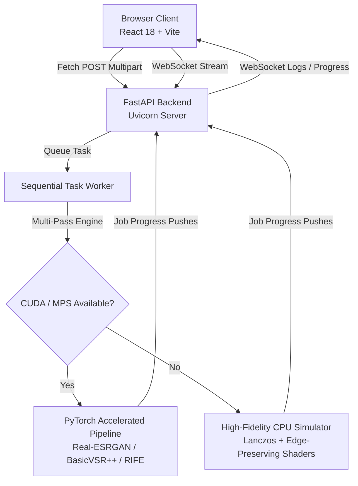

<!-- Header Block -->

   
  <!-- Glowing Animated Banner (Pure Vector CSS SVG) -->
  <svg width="100%" height="160" viewBox="0 0 800 160" fill="none" xmlns="http://www.w3.org/2000/svg">
    
    <!-- Background Blur Decorative Blobs -->
    <circle class="glow-blob" cx="180" cy="80" r="70" fill="#98ff98" />
    <circle class="glow-blob" cx="620" cy="90" r="60" fill="#e8f3ea" style="animation-delay: -4s;" />
    
    <!-- Title Text -->
    <text x="50%" y="80" dominant-baseline="middle" text-anchor="middle" class="text-title">U P S C A L E F O R G E</text>
    <text x="50%" y="125" dominant-baseline="middle" text-anchor="middle" class="text-subtitle">AI-POWERED IMAGE & VIDEO SUPER-RESOLUTION</text>
    
    <defs>
      <linearGradient id="mintGradient" x1="0%" y1="0%" x2="100%" y2="0%">
        <stop offset="0%" stop-color="#006e20" />
        <stop offset="50%" stop-color="#16a34a" />
        <stop offset="100%" stop-color="#006e20" />
      </linearGradient>
    </defs>
  </svg>

  

    
    
    
    
  

  
  

    A high-fidelity full-stack web application delivering state-of-the-art super-resolution and temporal frame interpolation for image and video formats. Completely local, sandboxed, and optimized for CUDA and Apple Silicon GPU cores.
  

<!-- AI Pipeline Pulse Monitor (Glow CSS vector SVG) -->

  <h3>⚡ Live AI Processing Pipeline Monitor</h3>
   
  <svg width="640" height="150" viewBox="0 0 640 150" fill="none" xmlns="http://www.w3.org/2000/svg" style="background: #111411; border-radius: 20px; border: 1px solid rgba(0,110,32,0.25); box-shadow: 0 10px 30px rgba(0,110,32,0.15);">
    

    <!-- Scanning Radar Grid -->
    <circle cx="320" cy="75" r="55" stroke="rgba(0,110,32,0.12)" stroke-width="1" />
    <circle cx="320" cy="75" r="35" stroke="rgba(0,110,32,0.08)" stroke-width="1" />
    <line x1="320" y1="20" x2="320" y2="130" stroke="rgba(0,110,32,0.08)" />
    <line x1="265" y1="75" x2="375" y2="75" stroke="rgba(0,110,32,0.08)" />
    
    <!-- Sweep Radar Line -->
    <line class="radar-sweep" x1="320" y1="75" x2="320" y2="20" stroke="rgba(152,255,152,0.3)" stroke-width="2" />

    <!-- Connected Data Flow Lines -->
    <path class="line-flow" d="M 80,75 L 265,75" stroke="#16a34a" stroke-width="2" />
    <path class="line-flow" d="M 375,75 L 560,75" stroke="#16a34a" stroke-width="2" style="animation-delay: -1.5s;" />
    
    <!-- Input Node -->
    <circle class="glow-node" cx="80" cy="75" r="6" />
    <text x="80" y="105" text-anchor="middle" class="tag-text">INPUT BUFFER</text>

    <!-- Active Processor Core (AI Kernel) -->
    <rect class="core-pulse" x="295" y="50" width="50" height="50" rx="10" fill="#006e20" stroke="#98ff98" stroke-width="2" />
    <text x="320" y="118" text-anchor="middle" class="tag-text" style="fill: #98ff98; font-weight: bold;">AI ENGINE</text>

    <!-- Output Node -->
    <circle class="glow-node" cx="560" cy="75" r="6" style="animation-delay: -1s;" />
    <text x="560" y="105" text-anchor="middle" class="tag-text">COMPILED OUT</text>
  </svg>

 

---

## 🌟 Key Features

<table width="100%">
  <tr>
    <td width="50%" valign="top">
      <h3>🖼️ AI Image Super-Resolution</h3>
      <ul>
        <li><b>Multi-Scale Selector</b>: 2×, 4×, 8× progressive, or Custom multiplier bounds from 1.5× to 16×.</li>
        <li><b>Next-Gen SOTA Models</b>: Real-ESRGAN, SwinIR Attention Transformer, and Generative SUPIR Diffusion.</li>
        <li><b>Interactive Split Canvas</b>: Real-time mouse-tracking comparator displaying raw source alongside actual compiled outputs.</li>
      </ul>
    </td>
    <td width="50%" valign="top">
      <h3>🎬 Temporal Video Upscaler</h3>
      <ul>
        <li><b>Cinema Presets</b>: Upscale to 1080p Full HD, 4K Cinema, or 8K Super Hi-Vision.</li>
        <li><b>RIFE Interpolation</b>: Smart motion vector calculations to double or quadruple FPS (30 to 60/120 fps).</li>
        <li><b>Device-Tailored Estimation</b>: Live dynamic estimation mathematically calculating execution times.</li>
      </ul>
    </td>
  </tr>
</table>

---

## 🎨 Visual Design Token System

This project is built strictly around a customized **Material 3 Mint System** for premium glassmorphism:

  <table style="border-collapse: collapse; border: none; background: transparent;">
    <tr style="background: transparent;">
      <td align="center" style="border: none;">
        

        <code style="font-size: 11px;">#006e20</code> <b>Primary Mint</b>
      </td>
      <td align="center" style="border: none; padding-left: 20px;">
        

        <code style="font-size: 11px;">#98ff98</code> <b>Container Highlight</b>
      </td>
      <td align="center" style="border: none; padding-left: 20px;">
        

        <code style="font-size: 11px;">Radial Gradient</code> <b>Background Depth</b>
      </td>
      <td align="center" style="border: none; padding-left: 20px;">
        

        <code style="font-size: 11px;">Glassmorphic</code> <b>Sidebar Panels</b>
      </td>
    </tr>
  </table>

---

## ⚡ Technical Architecture

---

## 🛠️ Interactive Details & Hardware Estimation

  

    🧬 How the Device-Adaptive Time Estimator works (Click to Expand)
  

  

    
UpscaleForge has an integrated performance profiling algorithm. When the workspace loads, the frontend queries the backend system resources to detect your GPU hardware tier:

    <ul>
      <li><b>Accelerated Tier (NVIDIA CUDA / Apple Silicon MPS)</b>: Estimates use low base coefficients, enabling lightning-fast predictions (e.g., ~3s for standard 4x images).</li>
      <li><b>Fallback CPU Tier</b>: Automatically applies a 3.5× to 5.0× multiplier factor to match processing timelines on non-GPU instances.</li>
      <li><b>Dynamic Video Formula</b>:
        <pre>Total Frames = Video Duration × Selected Target FPS (30/60/120) Total Time = Total Frames × Model Weight × Resolution Factor × Device Coefficient</pre>
      </li>
    </ul>
  

  

    🚀 Quick Setup & Run Instructions (Click to Expand)
  

  

    <h4>Prerequisites</h4>
    <ul>
      <li>Python 3.10+</li>
      <li>Node.js 18+</li>
      <li>FFmpeg installed and available on system PATH</li>
    </ul>
    
    <h4>Terminal 1 - Backend Server</h4>
    <pre>cd backend pip install -r pyproject.toml # or use poetry/pipenv python3 -m uvicorn main:app --host 0.0.0.0 --port 8000 --reload</pre>
    
    <h4>Terminal 2 - Frontend Web UI</h4>
    <pre>cd frontend npm install npm run dev</pre>
    
Open <b>http://localhost:5173/</b> in your browser and start upscaling!

  

  

    ⌨️ Power Keyboard Shortcuts (Click to Expand)
  

  

    <table width="100%">
      <thead>
        <tr style="background: rgba(0, 110, 32, 0.1);">
          <th>Shortcut</th>
          <th>Triggered Action</th>
        </tr>
      </thead>
      <tbody>
        <tr>
          <td><code>⌘O</code> / <code>Ctrl+O</code></td>
          <td>Launch native files upload prompt</td>
        </tr>
        <tr>
          <td><code>⌘1</code></td>
          <td>Switch to Image Workspace Mode</td>
        </tr>
        <tr>
          <td><code>⌘2</code></td>
          <td>Switch to Video Workspace Mode</td>
        </tr>
        <tr>
          <td><code>Space</code></td>
          <td>Play / Pause active video player timeline</td>
        </tr>
        <tr>
          <td><code>⌘Enter</code></td>
          <td>Submit job configuration and start Upscaling</td>
        </tr>
        <tr>
          <td><code>⌘D</code></td>
          <td>Download completed upscaled output stream</td>
        </tr>
        <tr>
          <td><code>Escape</code></td>
          <td>Instantly dismiss focus modals / overlays</td>
        </tr>
      </tbody>
    </table>
  

---

  

    built by anuj with love and nicotine
  

